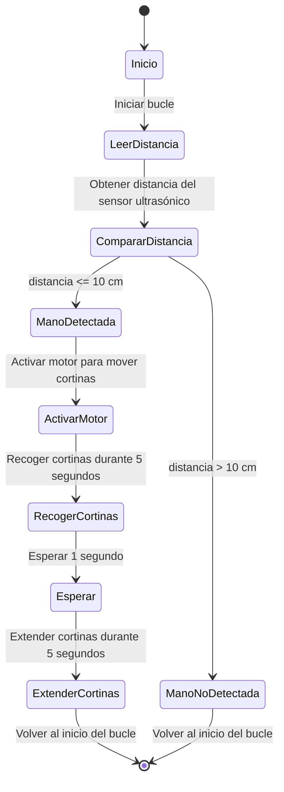

# Pagina 1

## Título del proyecto

Espacio Inmersivo

## Integrantes

Juan Jose Tobar Alvarez
Karina Guitierrez Cerquera
Cristian Eduardo Robayo Martinez

## Descripción y/o Introducción
El presente proyecto consiste en un **sistema automatizado para controlar cortinas** en un espacio inmersivo, utilizando un **ESP32** como núcleo de control, un **sensor ultrasónico** para detectar la proximidad de una persona y un **motor controlado por un puente H L293D** para mover las cortinas. Al acercarse la mano a menos de 10 cm del sensor, el sistema activa el motor para abrir o cerrar las cortinas, mientras una luz indicadora proporciona retroalimentación visual. Aunque enfrentamos desafíos como la gestión del tiempo y los costos de los componentes, el prototipo resultante demuestra cómo la tecnología puede crear interacciones intuitivas y funcionales en entornos inmersivos.

## Palabras clave
Inmersion, experiencia, automatizacion, PCB.

## Poster o brochure


## Imagen tipo banner de la implementación del proyecto (resultado final)


## Vídeo del proyecto: Deberá crear un vídeo y subirlo a una plataforma como puede ser Youtube, explicando del proyecto lo siguiente:


### La problemática
### La solución planteada (los módulos usados)
### El criterio que tuvo para las decisiones tomadas
### El funcionamiento del proyecto desde el punto de vista del usuario
## Recomendaciones y conclusiones

# Contexto (Página 2)

## Problemática
La problemática o dilema central de un espacio inmersivo basado en experiencias naturales es conciliar su doble impacto: en lo individual, busca provocar reflexión mediante la inclusión activa del usuario; en lo global, pretende redefinir el rol del espectador como eje indispensable para completar la obra.

## Objetivos

1.	Diseñar y desarrollar espacios en todas sus dimensiones, desde bocetos y modelado hasta su renderizado y simulación digital.
2.	Explorar la relación entre lo físico y lo virtual, aprovechando tecnologías como la realidad virtual y experiencias interactivas en la web.
3.	Crear experiencias inmersivas que evoquen emociones, transformando entornos tradicionales en espacios innovadores.
4.	Comprender el comportamiento del público para diseñar espacios que conecten con las personas y sus necesidades.
5.	Fusionar arte y funcionalidad, generando productos que puedan adaptarse a diferentes ámbitos como la producción audiovisual, el marketing y el entretenimiento.

## Alcance
El proyecto puede influir en pequeña escala a la gente que sea testigo o participante de la experiencia que dandole reflexion y regocijo dentro del hecho de su inclusion dentro de lo que representa y es la obra. Y en una escala mas global puede darle una vision fresca al mundo sobre la participacion del espectador dentro de una obra, dandole un papel mas influyente y necesario dentro de la obra, pues la ejecucion y muestra completa del objeto/obra se da a partir precisamente del usuario, 

## Ruta o roadmap o cronograma


# Diseño de la solución (Página 3)
## Diagramas de caja negra (abstractos)
La siguiente imagen muestra un diagrama de caja negra sobre el proyecto. 


## Diagramas tecnológicos

## Diagrama de flujo general del proyecto (cómo interactúa con el usuario final)
El sieguiente diagrama de flujo expone el proceso de interación del usuario final con el proyecto.


## Impacto ambiental y acciones propuestas de mitigación
---
### **Impactos ambientales identificados**

1. **Consumo energético de los dispositivos electrónicos**:  
   El uso de baterías recargables y componentes como el ESP32, el puente H y los proyectores implica un consumo constante de energía. Si la energía para recargar las baterías proviene de fuentes no renovables, se contribuye indirectamente a la emisión de gases de efecto invernadero. Además, las baterías mal gestionadas pueden convertirse en residuos peligrosos.

2. **Generación de residuos electrónicos**:  
   Los componentes electrónicos (ESP32, sensores, PCB, motores) tienen una vida útil limitada y pueden convertirse en residuos tóxicos si no se gestionan adecuadamente. Su fabricación también consume recursos no renovables y energía, generando un impacto ambiental significativo.

3. **Uso de materiales no reciclables o de difícil reciclaje**:  
   Algunos materiales adicionales (pinturas, adhesivos, cables, plásticos) pueden ser difíciles de reciclar o contener sustancias químicas dañinas. Si no se gestionan correctamente, pueden terminar en vertederos, contaminando suelos y fuentes de agua.

### **Acciones propuestas de mitigación:**

1. **Energía renovable y eficiencia**:  
   - Usar baterías recargables de larga duración y cargarlas con energía solar o renovable.  
   - Implementar sistemas de bajo consumo, como sensores que se activen solo con presencia humana.  

2. **Gestión de residuos electrónicos**:  
   - Establecer un plan de reciclaje para baterías y componentes electrónicos, llevándolos a centros especializados.  
   - Reutilizar o donar componentes en buen estado al finalizar el proyecto.  

3. **Selección de materiales sostenibles**:  
   - Optar por materiales reciclables o biodegradables en la construcción de arcos y estructuras.  
   - Evitar pinturas o adhesivos tóxicos, prefiriendo alternativas ecológicas.  

---

# Diseño e implementación del case 

## Diseño corte 3D o corte láser
Para la fabricación de la estructura de madera MDF se utilizó el diseño expuesto a continuación


En la siguiente imagen se muestra una versión a escala reducira de la estructura en madera realizada. Esta se usó para ajustar medidas y pruebas de funcionamiento.


## Evidencias de implementación (imágenes, vídeos)


# Diseño e implementación electrónica 

## Simulaciones según haya sido necesario (opcional)
## Imágenes sobre los diseños creados (papel/tablero) sobre las tecnologías a usar
El siguiente video muestra una versión en miniatura del espacio inmersivo. Este utiliza las tecnologías más básicas que hacen parte del funcionamiento del proyecto.

https://github.com/user-attachments/assets/f787885c-6999-43d3-8214-14c2c1815ee7

## Diseño de PCB en KiCad:

### Diseño esquemático del circuito en pdf y png

(en los archivos subidos)

### Diseño de PCB layout (imagen del ruteo)


### Imagen PNG en 3D del diseño final de la PCB


### Fotografías de la PCB fabricada
https://github.com/user-attachments/assets/73bcb2f3-013d-4cea-b828-6a951bb66e76

### Imagen de la PCB con componentes soldados

### Imagen de la PCB con los sensores, actuadores y demás componentes interconectados


# Diseño e implementación de software 

## Diagrama(s) de flujo sobre las diferentes tareas que realiza el proyecto (A nivel de la solución)



## Código sobre las diferentes pruebas unitarias de sensores y actuadores


## Diagramas o código explicado sobre el cómo interactúa con otras interfaces
```python
# platform: micropython-esp32
# send: wifi
# ip_mpy: 192.168.4.1
# serialport: 
# filename: main.py

from machine import Pin
from machine import ADC
from time import sleep
from hcsr04 import HCSR04

# Configuración del sensor ultrasónico (HCSR04)
# - trigger_pin: Pin de salida para enviar el pulso ultrasónico.
# - echo_pin: Pin de entrada para recibir el eco del pulso.
# - echo_timeout_us: Tiempo máximo para esperar el eco (en microsegundos).
sensor = HCSR04(trigger_pin=5, echo_pin=18, echo_timeout_us=30000)

# Configuración de pines para controlar el puente H L293D
# - en: Habilita el puente H (activar/desactivar el motor).
# - tran1 y tran2: Controlan la dirección del motor.
en = Pin(13, Pin.OUT)
tran1 = Pin(22, Pin.OUT)
tran2 = Pin(23, Pin.OUT)

# Configuración del pin para controlar una luz (LED)
luz = Pin(2, Pin.OUT)

# Función para medir la distancia con el sensor ultrasónico
def distancia():
    distance = sensor.distance_cm()  # Obtiene la distancia en centímetros
    return distance

# Función para mover el motor hacia adelante
def adelante(en, tran1, tran2):
    en.value(1)   # Habilita el puente H
    tran1.value(1)  # Activa el pin 1 del puente H
    tran2.value(0)  # Desactiva el pin 2 del puente H

# Función para mover el motor hacia atrás
def atras(en, tran1, tran2):
    en.value(1)   # Habilita el puente H
    tran1.value(0)  # Desactiva el pin 1 del puente H
    tran2.value(1)  # Activa el pin 2 del puente H

# Función para detener el motor
def quieto(en, tran1, tran2):
    en.value(1)   # Habilita el puente H
    tran1.value(0)  # Desactiva ambos pines del puente H
    tran2.value(0)

# Bucle principal del programa
while True:
    # Medir la distancia con el sensor ultrasónico
    distanciasaurio = distancia()
    print("Distancia: {:.2f} cm".format(distanciasaurio))

    # Si el objeto está a menos de 5 cm, activar el motor y la luz
    if distanciasaurio > 0 and distanciasaurio < 5:
        luz.value(1)  # Encender la luz
        adelante(en, tran1, tran2)  # Mover el motor hacia adelante
        sleep(5)  # Esperar 5 segundos
        quieto(en, tran1, tran2)  # Detener el motor
        sleep(1)  # Esperar 1 segundo
        atras(en, tran1, tran2)  # Mover el motor hacia atrás
        sleep(5)  # Esperar 5 segundos
    else:
        # Si no hay objeto cerca, apagar la luz y detener el motor
        luz.value(0)  # Apagar la luz
        quieto(en, tran1, tran2)  # Detener el motor

    sleep(5)  # Esperar 5 segundos antes de repetir el bucle
```

## Otros códigos y plataformas usadas (NodeJS, Appinventor, etc).


# Evidencias 


## Puede subir información sobre el proceso de integración y de ensamble de cada cosa que sea relevante para el grupo por ejemplo, aquellas cosas que no funcionaron o se dañaron, aquellas cosas que fueron 
descubrimientos, aciertos o desaciertos.


# Conclusiones y recomendaciones futuras

## Conclusiones
El presente proyecto de control de cortinas con sensor ultrasónico y ESP32 demostró ser una solución innovadora y funcional para automatizar espacios inmersivos. Aunque logramos integrar correctamente los componentes (sensor, motor, luz y ESP32) y el código funcionó como esperábamos, enfrentamos desafíos significativos. Por un lado, el tiempo fue un factor limitante, lo que nos obligó a optimizar el desarrollo y las pruebas. Por otro, el costo del hardware, especialmente el puente H L293D y el ESP32, resultó más elevado de lo previsto. A pesar de estos obstáculos, el proyecto cumplió su objetivo y nos dejó valiosas lecciones sobre integración de hardware y software, así como sobre la importancia de una planificación eficiente.


## Recomendaciones para trabajos futuros
Para las personas que quieran replicar el presente proyecto se tienen las siguientes recomendaciones. Esto para que se pueda obtener un resultado de alta calidad según sus necesidades
1. **Optimización de componentes**:
   - Explorar alternativas más económicas para algunos componentes, como sensores ultrasónicos o motores, sin sacrificar la calidad. Esto puede ayudar a reducir costos en futuras iteraciones del proyecto.

2. **Integración con interfaces adicionales**:
   - Considerar agregar una interfaz de control remoto, como una aplicación móvil, para manejar las cortinas de manera más versátil y mejorar la experiencia del usuario.

3. **Mejora en la eficiencia energética**:
   - Implementar un modo de bajo consumo cuando el sistema no esté en uso activo, lo que prolongaría la vida útil de las baterías y haría el proyecto más sostenible.

## Referentes (Referencias sobre inspiraciones, códigos base o documentación consultada relevante)
